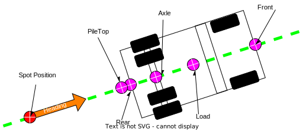

# Open-Autonomy Spot Interface definition
This section will explain the Spot service requirements, use cases and specify the messaging format.

### [Message specification](./specification/README.md)
### [Message flow diagram](./MessageFlow.md)

 

# Introduction
This repo is dedicated at documenting the Spot service.  One of the services used in the open-autonomy family.

 

# Spot Service Purpose
The spot service is meant to facilitate in-pit interactions between people in heavy equipment and autonomous haul trucks.  The service is designed for real-time mine operations and all message transactions are expected to occur in real-time.

 

# Audience
- Autonomy integrators ( typically miners )
- Autonomous truck suppliers ( Engineering )
- Fleet Management suppliers ( Engineering )

 

# What is a Spot ?
A spot is a place in the mine where operators want a vehicle to precisely position itself and execute a mining task.

 

## A spot possesses these attributes
1. a point represented by an absolute position on earth (LLE)
2. a heading vector pointing towards the front of the vehicle
3. a `truck origin`, one of 5 significant points on a truck
4. an Ingress/Egress method
5. a `task` that the truck should execute

In the graphic below, the spot is represented by a red dot with an orange arrow.  

  

## Truck origin
The `truck origin` attribute of the spot identifies a location on the truck that the electronic driver must align with the spot position.  There are 5 origins defined for a haul truck:
1.	Front
2.	Load
3.	Axle
4.	Rear
5.	Pile

  

## Spot Ingress / Egress
The Ingress/Egress method specifies if the vehicle should go into the spot forward or backward, and the same for exiting the spot.  The combination of these 2x2 possibilities creates 4 types of Ingress/Egress
- Pull Through	: drive forward in and drive forward out
- Back In		: reverse into the spot and leave driving forward
- Back Out		: drive forward in and reverse to leave
- Back Through	: drive in backwards and leave driving backwards

 

## Spot Task
The task of a spot tells the electronic driver what is the expected behavior once it has completed spotting.  There are 7 different expected behaviors wanted by open pit miners:
1.	Load,
2.	Dump at Crusher,
3.	Dump Paddock style,
4.	Dump Over the Edge,
5.	Fuel,
6.	Park,
7.	Wait

 

## Spot completed
A truck is considered “Spotted” once it has stopped moving within the desired accuracy with its front pointing in the heading direction.  Mine operators will have the ability to configure an error tolerance both in position and heading.  That error tolerance is site & truck model specific and not transmitted to the spot service.  Once spotted at the right location, then the truck will start executing the task.

 

# What is an Origin ?
An origin is defined as an *a priori* agreed upon reference point that each truck can translate to their local coordinate system.  So a spot position sent to the truck is always in reference to one of these specific origin.

Because specific mining use cases, different spots will care about a specific part of the truck to aligning with somthing external lke:
- other vehicles,
- other equipment or
- earth works  (berms, v-drains)

The origin allows the system to focus on the right part of the truck and allows for a mixed SIZE fleet of truck because each truck knows its intrinsic dimensions and can aligns the right part of the vehicle with the specified position.  Origins are logical (semantic based) points defined along the equipment’s center line.

 

# What is a task ?
A task is a high-level mining concept of what the truck needs to do once it has reached the designed spot.  The task needs to be translated by the truck's electronic driver into a set of instructions to the base truck that are very specific to the truck's size, capability and sensor set.

> e.g. The task: `"Dump over the edge" here at this spot` could translate to:
 - Do not plan a path that is parallel to the edge within 10 meters of the edge.
 - The truck must plan a path that is perpendicular to the edge from >10 meters away.
 - Use rear sensors as truck backs up so it can make sure that:
   o	Truck won’t drive over the edge
   o	Truck must detect the top and bottom of the burm
   o	Place tire position so tire just hugs the burm as per AHS configuration with hugging distance = x.x meters.
   o	Make sure the edge is not collapsing as truck approaches the edge
 -Once tire hugs burm, raise the tray at 45 degree with maximum velocity and wait 10 seconds so material can be ejected as far as possible over the edge and minimize dozer cleanup
 - Then raise tray at 100% to finish the dump and wait 20 seconds with tray at 100%
 - With the tray up, then move forward Y meters to clean any remaining material that is still in the tray
 - If the weather is wet, stop abruptly once Y meter is reached to minimize carryback
 - Then drive slowly forward (or stay stationary) while lowering the tray completely down.
 - The dumping task is now complete.
